# Cusp Entity-Relationship Model

Data model for **Cusp** (Agentic Delivery Lifecycle Graph) — the entities Cusp stores
and manages in its [Dolt](https://www.dolthub.com/) database. The model is split across the
files listed below; this index holds the layer overview and the master diagram.

> Status: **draft (v2)**. Cusp is the **system of record**: it owns this data outright rather
> than mirroring any external tool. Domain-specific prose stays in text fields. Column types
> are suggestions (Dolt is MySQL-compatible). Naming follows the corpus convention:
> `snake_case`, lowercase enum values. Keys follow one scheme — see
> [Identifiers & keys](identifiers.md).

## Sections

| File | Layer | Entities |
|---|---|---|
| [identifiers.md](identifiers.md) | Identifiers & keys | ULID PKs · business keys · display IDs |
| [structure.md](structure.md) | Structure | `Domain`, `Spec`, `SpecSection`, `SpecSectionType` |
| [requirements.md](requirements.md) | Requirements | `UserStory`, `AcceptanceScenario`, `Requirement`, `RequirementGroup`, `Milestone`, `Edge`, `EntityRef`, `DeliveryStatus`, `Priority` |
| [testing.md](testing.md) | Testing (Qase-style) | `TestSuite`, `TestCase`, `TestStep`, `TestRun`, `TestResult`, `Configuration` |
| [planning.md](planning.md) | Planning | `Capability`, `Deliverable`, `View` + junctions |
| [authorization.md](authorization.md) | Entity layer | `Entity`, `EntitySection`, `EntitySectionType`, `EntityAttribute`, `EntityRelationship` |
| [interop.md](interop.md) | Interop | `ExternalRef` |
| [glossary.md](glossary.md) | Glossary | `GlossaryTerm`, `GlossaryAlias` |
| [review.md](review.md) | Review & collaboration | `Changeset`, `Review`, `Comment`, `Actor` |
| [enums.md](enums.md) | Reference | all enum value sets |
| [decisions.md](decisions.md) | Reference | resolved decisions / open questions |

## Layers

- **Structure** — `Domain`, `Spec`: the document tree (directories derived from `Spec.path`). A spec's
  prose sections are `SpecSection` rows, each addressed by a curated `SpecSectionType` — the shared
  vocabulary agents select from (headings outside it fold into `notes` on import; new types cost a
  deliberate, separate step). Render order is canonical (`SpecSectionType.position`), so structure stays
  consistent across docs and a regenerate is information-complete.
- **Requirements** — `UserStory`, `AcceptanceScenario`, `Requirement`, `Milestone`, `Edge`
  (hand-authored, structured relationships), `EntityRef` (prose-derived inline `[[TYPE:key]]` references).
- **Testing (Qase-style)** — `TestSuite`, `TestCase`, `TestStep`, `TestRun`, `TestResult`,
  `Configuration`; cases cover requirements many-to-many.
- **Planning** — `Capability`, `Deliverable`, `View`: *what to build*, joined to the corpus
  through shared `Domain` + `Milestone` and a `View → Spec` link.
- **Entity layer** — `Entity`, `EntitySection`/`EntitySectionType` (the entity-doc prose mirror of
  `SpecSection`), `EntityAttribute`, `EntityRelationship`: the business-domain entity glossary.
  Row-level access is documented as entity-doc prose (an `access_control` `EntitySection`), not a
  structured authorization table (the `Privilege`/`AccessRule` model was removed in migration `0012` —
  see [decisions.md](decisions.md)).
- **Interop** — `ExternalRef`: a node's id in an outside task system (Jira, Rally, beads, …).
- **Glossary** — `GlossaryTerm`, `GlossaryAlias`: shared project vocabulary, defined once and
  referenced everywhere via inline `[[TERM:slug]]` links; a first-class cross-reference target.
- **Review & collaboration** — `Changeset`, `Review`, `Comment`, `Actor`: human review
  of agent changes (approve/deny/comment), bridged to Dolt branches/commits. History and diff
  are Dolt-native (`dolt_history_*` / `dolt_diff_*`), not modeled here.

## Master diagram

> Attribute blocks show `id` generically as `bigint` — read every `id` as a ULID surrogate
> PK, **except** the pure-relationship tables (`Edge`, `EntityRef`, `TestResult`, junctions), whose PK is
> derived deterministically from the row's identity (see [Identifiers & keys](identifiers.md)).

```mermaid
erDiagram
    DOMAIN          ||--o{ SPEC          : categorizes
    SPEC            ||--o{ USER_STORY    : contains
    USER_STORY      ||--o{ ACCEPTANCE_SCENARIO : has
    SPEC            ||--o{ REQUIREMENT   : owns
    SPEC            ||--o{ REQUIREMENT_GROUP : "FR groups"
    REQUIREMENT_GROUP ||--o{ REQUIREMENT : groups
    SPEC            ||--o{ SPEC_SECTION   : "prose sections"
    SPEC_SECTION    }o--|| SPEC_SECTION_TYPE : "typed by"
    ENTITY          ||--o{ ENTITY_SECTION : "prose sections"
    ENTITY_SECTION  }o--|| ENTITY_SECTION_TYPE : "typed by"
    REQUIREMENT     ||--o{ REQUIREMENT   : "sub-requirement of"
    REQUIREMENT     }o--o{ TEST_CASE     : "covered by"
    MILESTONE       |o--o{ REQUIREMENT   : targets
    DELIVERY_STATUS ||--o{ REQUIREMENT   : "classifies (by key, not FK)"
    PRIORITY        ||--o{ USER_STORY    : "prioritizes (by level, not FK)"
    PRIORITY        ||--o{ REQUIREMENT   : "prioritizes (by level, not FK)"

    TESTSUITE       ||--o{ TESTSUITE     : "parent of"
    TESTSUITE       ||--o{ TEST_CASE     : contains
    TEST_CASE       ||--o{ TEST_STEP     : has
    TEST_CASE       ||--o{ TEST_RESULT   : "executed as"
    TEST_RUN        ||--o{ TEST_RESULT   : includes
    TEST_RUN        }o--o{ CONFIGURATION : "runs against"
    CONFIGURATION   |o--o{ TEST_RESULT   : under
    MILESTONE       |o--o{ TEST_RUN      : scopes
    ENTITY          ||--o{ ENTITY_ATTRIBUTE     : has
    ENTITY          ||--o{ ENTITY_RELATIONSHIP  : "from"
    EDGE            }o--o{ REQUIREMENT   : "links (polymorphic, hand-authored)"
    ENTITY_REF      }o--o{ REQUIREMENT   : "cites (polymorphic, prose-derived)"
    DOMAIN          ||--o{ GLOSSARY_TERM : scopes
    GLOSSARY_TERM   ||--o{ GLOSSARY_ALIAS : "known as"
    ENTITY_REF      }o--o{ GLOSSARY_TERM : "cites (polymorphic, prose-derived)"

    DOMAIN          ||--o{ CAPABILITY   : categorizes
    DOMAIN          ||--o{ VIEW         : categorizes
    CAPABILITY      ||--o{ CAPABILITY   : "parent of"
    CAPABILITY      }o--o{ MILESTONE    : "planned in"
    MILESTONE       |o--o{ DELIVERABLE  : targets
    CAPABILITY      }o--o{ DELIVERABLE  : "delivered by"
    DELIVERABLE     }o--o{ VIEW         : surfaces
    DELIVERABLE     }o--o{ DELIVERABLE  : "blocked by"
    VIEW            }o--o| SPEC         : "documented by"
    DELIVERABLE     ||--o{ EXTERNAL_REF : "tracked in (polymorphic)"
    REQUIREMENT     ||--o{ EXTERNAL_REF : "tracked in"
    TEST_RESULT     ||--o{ EXTERNAL_REF : "tracked in"

    ACTOR           ||--o{ CHANGESET : authors
    ACTOR           ||--o{ REVIEW          : "reviews as"
    ACTOR           ||--o{ COMMENT         : writes
    CHANGESET ||--o{ REVIEW          : has
    CHANGESET ||--o{ COMMENT         : has
    COMMENT         ||--o{ COMMENT         : "reply to"

    DOMAIN {
        bigint id PK
        string slug UK
        string name
        text   description "one-line summary, nullable"
        enum   status "draft|active|deprecated"
    }
    SPEC {
        bigint id PK
        bigint domain_id FK "top-level dir; not repeated in path"
        string prefix UK "nullable for FR-exempt"
        string slug "filename stem; file = slug.md"
        string path "directory only, no filename; UK(domain_id, path, slug)"
        string title
        enum   status "draft|reviewed|active|obsolete"
        date   created_at
        date   updated_at
    }
    USER_STORY {
        bigint id PK
        bigint spec_id FK
        int    position "per-spec, no global id"
        string title
        int    priority "0-4 level → PRIORITY"
        string as_a
        text   i_want
        text   so_that
        text   narrative "prose-style body, nullable"
        text   why_priority
        text   independent_test
    }
    ACCEPTANCE_SCENARIO {
        bigint id PK
        bigint user_story_id FK
        int    position
        text   given
        text   when
        text   then
    }
    REQUIREMENT {
        bigint   id PK
        bigint   spec_id FK
        int      number "sequential within spec"
        char     suffix "optional sub-letter, nullable"
        bigint   parent_id FK "self, sub-requirements, nullable"
        bigint   group_id FK "RequirementGroup, nullable"
        int      position "document order within the FR list"
        text     statement "the MUST text"
        enum     content_status "draft|active|obsolete"
        enum     delivery_status "covered|test-pending|not-implemented|e2e-sufficient|shared|schema-only|deferred"
        bigint   milestone_id FK "nullable"
        int      priority "0-4 level → PRIORITY, nullable"
        text     notes
        date     tombstoned_at "nullable"
        datetime created_at
        datetime updated_at
    }
    PRIORITY {
        int      level PK "0 Critical .. 4 Backlog"
        string   label
        text     description
        datetime created_at
        datetime updated_at
    }
    DELIVERY_STATUS {
        string   slug PK "business value, = requirement.delivery_status"
        string   label
        text     description
        int      sequence
        bool     counts_as_covered
        bool     requires_e2e_test
        bool     requires_shared_test
        bool     requires_milestone
        datetime created_at
        datetime updated_at
    }
    TESTSUITE {
        bigint id PK
        bigint parent_id FK "self, nullable"
        string name
        text   description
        int    position "ordering, nullable"
    }
    TEST_CASE {
        bigint   id PK
        bigint   suite_id FK
        string   title
        text   description
        text   preconditions
        enum   layer "unit|integration|e2e|component|shared"
        enum   type "functional|smoke|regression|acceptance|other"
        int    priority "0-4 level → PRIORITY"
        enum   severity "trivial|minor|normal|major|critical|blocker"
        enum   automation "manual|automated|to_be_automated"
        enum   status "draft|active|deprecated"
        string path "automated test file, nullable"
        bool   is_flaky
        datetime created_at
        datetime updated_at
    }
    TEST_STEP {
        bigint id PK
        bigint test_case_id FK
        int    position
        text   action
        text   expected_result
    }
    TEST_RUN {
        bigint   id PK
        string   title
        text     description
        enum     status "active|complete|aborted"
        bigint   milestone_id FK "nullable"
        datetime started_at
        datetime ended_at
    }
    TEST_RESULT {
        bigint   id PK
        bigint   run_id FK
        bigint   test_case_id FK
        bigint   configuration_id FK "nullable"
        enum     status "passed|failed|blocked|skipped|invalid|in_progress"
        text     comment
        int      duration_ms "nullable"
        text     stacktrace "nullable"
        string   executed_by "nullable"
        datetime executed_at "nullable"
    }
    CONFIGURATION {
        bigint id PK
        string group "e.g. Browser, OS, Environment"
        string name "value, e.g. Chrome"
        text   description "nullable"
    }
    REQUIREMENT_GROUP {
        bigint id PK
        bigint spec_id FK
        int    position "order within the spec's FR list"
        string title "sub-header text, unique per spec"
        text   notes "interspersed prose, nullable"
    }
    MILESTONE {
        bigint   id PK
        string   slug UK "e.g. M0..M7, Future"
        string   name
        text     description
        int      sequence
        enum     status "complete|in_progress|pending"
        datetime created_at
        datetime updated_at
    }
    EDGE {
        bigint id PK
        enum   from_type "requirement|spec|user_story|entity|milestone"
        bigint from_id FK
        enum   to_type "requirement|spec|user_story|entity|milestone"
        bigint to_id FK
        enum   kind "references|refines|depends_on|supersedes|relates|defers_to"
    }
    ENTITY_REF {
        bigint id PK
        enum   owner_type "domain|spec|requirement|user_story|entity|milestone|glossary_term"
        bigint owner_id FK
        enum   target_type "domain|spec|requirement|entity|milestone|glossary_term"
        bigint target_id FK
    }
    GLOSSARY_TERM {
        bigint   id PK
        string   slug UK "link key, e.g. make-up-credit"
        string   term "display name"
        text     definition "may contain inline [[..]] links"
        bigint   domain_id FK "optional scoping, nullable"
        enum     status "draft|active|deprecated"
        datetime created_at
        datetime updated_at
    }
    GLOSSARY_ALIAS {
        bigint id PK
        bigint term_id FK
        string alias UK "alternate surface form, global unique"
    }
    ENTITY {
        bigint id PK
        string path "sub-dir under entities/, nullable; filename = kebab(name)"
        string name UK
        text   description "glossary one-liner (not a doc section)"
        enum   status "draft|active|deprecated"
    }
    ENTITY_ATTRIBUTE {
        bigint id PK
        bigint entity_id FK
        string name "domain property name"
        text   description "business meaning"
        string category "doc grouping, nullable"
        bool   is_derived
        int    position "nullable"
    }
    ENTITY_RELATIONSHIP {
        bigint id PK
        bigint from_entity_id FK
        bigint to_entity_id FK
        enum   cardinality "one_to_one|one_to_many|many_to_many"
        string junction_table "nullable"
        text   notes
    }
    CAPABILITY {
        bigint id PK
        string title
        enum   level "domain|epic|capability"
        bigint domain_id FK
        bigint parent_id FK "self, nullable"
    }
    DELIVERABLE {
        bigint id PK
        string title
        enum   size "S|M|L|XL, nullable"
        enum   status "proposed|specced|wired|built|ship"
        enum   ai_ready "yes|no|na"
        bigint milestone_id FK "nullable"
    }
    VIEW {
        bigint id PK
        string title
        string route "app route"
        bigint spec_id FK "nullable"
        bigint domain_id FK
    }
    EXTERNAL_REF {
        bigint id PK
        enum   subject_type "deliverable|requirement|test_result"
        bigint subject_id FK
        string system "jira|rally|beads|linear|github|other"
        string external_id "id/key in that system"
        string url "deep link, nullable"
    }
    ACTOR {
        bigint id PK
        enum   kind "human|agent"
        string name
        string handle UK "maps to Dolt committer"
        string agent_tool "claude|codex|cursor|..., nullable"
    }
    CHANGESET {
        bigint   id PK
        string   title
        text     description
        bigint   author_id FK
        enum     status "draft|open|changes_requested|approved|denied|merged|closed"
        string   branch UK "Dolt branch"
        string   base_commit
        string   head_commit
        string   merge_commit "nullable"
        datetime created_at
        datetime updated_at
    }
    REVIEW {
        bigint   id PK
        bigint   changeset_id FK
        bigint   reviewer_id FK
        enum     verdict "approve|deny|request_changes"
        text     summary
        datetime created_at
    }
    COMMENT {
        bigint   id PK
        bigint   changeset_id FK
        bigint   author_id FK
        bigint   parent_id FK "self, threading, nullable"
        text     body
        enum     subject_type "requirement|spec|user_story|test_case|entity|deliverable, nullable"
        bigint   subject_id FK "nullable, polymorphic"
        string   locator "field/diff hunk, nullable"
        bool     resolved
        datetime created_at
        datetime updated_at
    }
    SPEC_SECTION_TYPE {
        string slug PK
        text   title "rendered as the ## heading; empty = headingless"
        int    level "2=##, 3=###, 0=headingless"
        int    position "canonical render order"
        text   description "guidance for picking; nullable"
        enum   origin "builtin|authored"
    }
    SPEC_SECTION {
        bigint id PK
        bigint spec_id FK
        string section_type_slug FK "curated type; NOT NULL"
        text   body
    }
    ENTITY_SECTION_TYPE {
        string slug PK
        text   title "rendered as the ## heading; empty = headingless"
        int    level "2=##, 0=headingless"
        int    position "canonical render order"
        text   description "guidance for picking; nullable"
        enum   origin "builtin|authored"
    }
    ENTITY_SECTION {
        bigint id PK
        bigint entity_id FK
        string section_type_slug FK "curated type; NOT NULL"
        text   body
    }
```

All enum value sets are consolidated in [enums.md](enums.md); settled choices are recorded in
[decisions.md](decisions.md).
